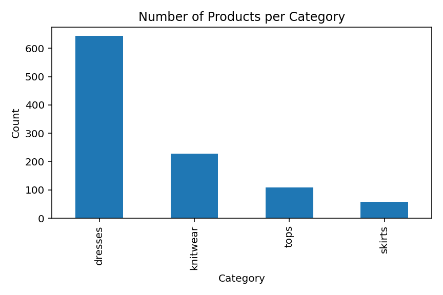
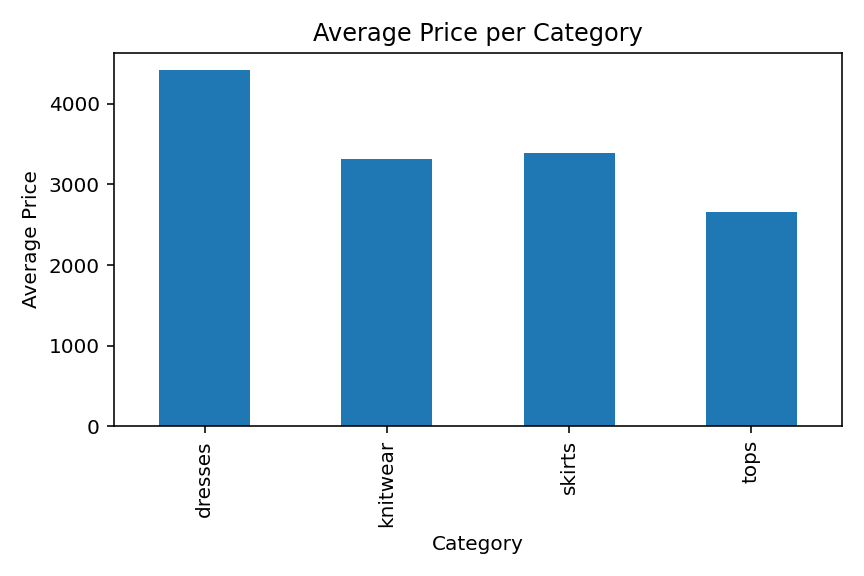
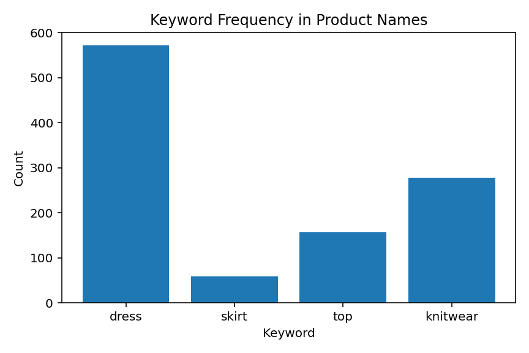

# zeynep_yagmur_demir_dsa210project
# DSA 210 Project - Fashion Product Popularity Analysis

## Project Topic
This project explores how fashion product popularity differs across selected women's clothing categories.

## Dataset
The dataset consists of products from the following categories:
- Dresses & Jumpsuits
- Skirts
- Tops & Bodysuits
- Knitwear

## Data Processing
- Combined multiple category datasets into one dataset
- Added category labels
- Cleaned the price column
- Removed unnecessary columns

## Exploratory Data Analysis (EDA)
- Analyzed number of products per category
- Compared average prices across categories
- Visualized category distribution and price differences

## Detailed Results

- Total number of products: 1038
- Dresses & Jumpsuits: 643 products
- Knitwear: 228 products
- Tops & Bodysuits: 108 products
- Skirts: 59 products

### Average Prices

- Dresses & Jumpsuits: 4415.51
- Skirts: 3395.08
- Knitwear: 3318.07
- Tops & Bodysuits: 2654.81

### Keyword Counts

- "dress": 572
- "knit": 278
- "top": 157
- "skirt": 59

## Visualizations

### Category Distribution

### Average Price by Category

### Keyword Frequency

## Initial Findings
- Dresses are the most common category in the dataset
- Dresses have the highest average price
- Tops have the lowest average price
- Product name analysis shows “dress” appears most frequently

## Hypothesis
Products associated with popular fashion trends appear more frequently in the dataset.

## Next Steps
- Improve analysis
- Add trend-based data (Google Trends)
- Apply machine learning methods
